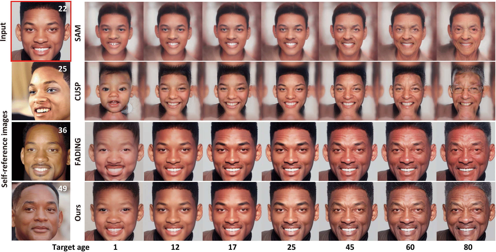

# SelfAge: Personalized Facial Age Transformation Using Self-reference Images



This code is our implementation of the following paper:

Taishi Ito, Yuki Endo, Yoshihiro Kanamori: "SelfAge: Personalized Facial Age Transformation Using Self-reference Images" [arXiv (coming soon)]

## Abstract
> Age transformation of facial images is a technique that edits age-related person's appearances while preserving the identity. Existing deep learning-based methods can reproduce natural age transformations; 
however, they only reproduce averaged transitions and fail to account for individual-specific appearances influenced by their life histories. In this paper, we propose the first diffusion model-based method for personalized age transformation. Our diffusion model takes a facial image and a target age as input and generates an age-edited face image as output. To reflect individual-specific features, we incorporate additional supervision using *self-reference images*, which are facial images of the same person at different ages. Specifically, we fine-tune a pretrained diffusion model for personalized adaptation using approximately 3 to 5 self-reference images. Additionally, we design an effective prompt to enhance the performance of age editing and identity preservation. Experiments demonstrate that our method achieves superior performance both quantitatively and qualitatively compared to existing methods.

## Prerequisites

### Installation

Run the following code to install all conda packages.

```
conda env create -f environment/selfage_env.yml
```

### Pretrained Model

Download following pretrained model from path and save to the directory `pretrained_model`.

Path | Description
---------- | -----------------
[DEX age classifier](https://drive.google.com/file/d/1mE_EStue-f7yXGOzpl4qxM3vM270TnLc/view?usp=sharing)  |  VGG age classifier from DEX to estimate the age of the input image. Fine-tuned by [yuval-alaluf](https://github.com/yuval-alaluf/SAM) on the FFHQ-Aging dataset.

### Regularization Set

Download following regularization set from path and unzip it.

Path | Description
---------- | -----------------
[Regularization set](https://drive.google.com/file/d/1ldHHqVCPb46vZZKM_rhboxrHc0UtTukc/view?usp=sharing)  |  Regularization set for use in training. Originally created by [sudban3089](https://github.com/sudban3089/ID-Preserving-Facial-Aging) and labeled with DEX age classifier by ourselves.


## Train

Training personalized model in the paper can be done by running the following command:

```
accelerate launch scripts/train.py \
--self_ref_data_dir=/path/to/self-ref_images \
--output_dir=/path/to/experiment \
--regularization_dir=/path/to/regularization_set \
--with_prior_preservation \
--prior_loss_weight=1.0 \
--contrast_weight=0.1 \
--instance_prompt="photo of sks person" \
--resolution=512 \
--train_batch_size=4 \
--gradient_accumulation_steps=1 \
--checkpointing_steps=1000 \
--learning_rate=1e-6 \
--lr_scheduler=constant \
--lr_warmup_steps=0 \
--max_train_steps=800 \
--validation_prompt="photo of sks person" \
--validation_epochs=50 \
--train_text_encoder \
--rank=16 \
--num_instance_images=3
```

Note:
* You can specify the base diffusion model to fine-tune with `--base_model`.

## Inference

Age editing with personalized model in the paper can be done by running the following command:

```
python scripts/age_editing.py \
--data_path=/path/to/test_data \
--gender=[female or male] \
--exp_dir=/path/to/experiment \
--personalized_path=/path/to/personalized_model  \
--target_age=0,10,20,30,40,50,60,70,80 \
--test_batch_size=4 \
--test_workers=4
```

Notes:
* You can specify base diffusion model with `--base_model`. Change it to match your personalized model if you chose a different one when you trained yourself.
* Add `--side_by_side` to save all aging results for a input image of a given input side-by-side.
* You don't have to specify gender, but it can lead to poorer identity preservation.

## Citation
Please cite our paper if you find the code useful:
```
@article{ItoSelfage25,
      author    = {Taishi Ito and Yuki Endo and Yoshihiro Kanamori},
      title     = {SelfAge: Personalized Facial Age Transformation Using Self-reference Images},
      journal   = {},
      volume    = {},
      number    = {},
      pages     = {},
      year      = {2025},
      publisher = {}
}
```


## Acknowledgements
This code heavily borrows from the [FADING](https://github.com/MunchkinChen/FADING) and [IDP](https://github.com/sudban3089/ID-Preserving-Facial-Aging) repository.
